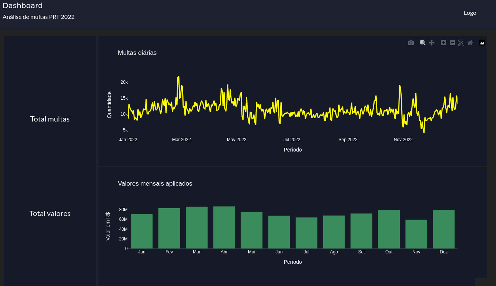

<!DOCTYPE html>
<html lang="pt-br">
<head>
  <meta charset="UTF-8">
  <title>README</title>
</head>
<body>

<h1>Projeto de Análise de Dados de Infrações de Trânsito</h1>

<p>Este projeto tem como objetivo analisar dados de infrações de trânsito do estado de Minas Gerais. Os dados foram coletados por meio de web-scrapping do site do Detran-MG.</p>




<h2>Estrutura do Projeto</h2>

<ul>
  <li><b>data</b>: Pasta que contém os dados coletados, incluindo a base de dados consolidada, dados diários e dados mensais.</li>
  <li><b>logs</b>: Pasta que contém o log de execução do projeto.</li>
  <li><b>notebooks</b>: Pasta que contém os notebooks Jupyter utilizados para a ingestão e análise dos dados.</li>
  <li><b>README.md</b>: Este arquivo.</li>
  <li><b>requirements.txt</b>: Arquivo que lista as dependências do projeto.</li>
  <li><b>scripts</b>: Pasta que contém os scripts Python utilizados para a ingestão e análise dos dados.</li>
</ul>

<h2>Resultados</h2>

<p>O resultado do projeto é um dashboard gerado com Dash, que apresenta informações sobre as infrações de trânsito em Minas Gerais. O dashboard está disponível na imagem <a href="data/images/image-dashboard.jpeg">image-dashboard.jpeg</a>.</p>

<h2>Como executar o projeto</h2>

<p>Para executar o projeto, siga as seguintes etapas:</p>

1. Instale as dependências do projeto executando o seguinte comando:

```pip install -r requirements.txt```

2. Execute o script `DataIngestion.py` para coletar os dados:

```python scripts/DataIngestion.py```

3. Execute o script `app.py` para iniciar o dashboard:

```python scripts/app.py```